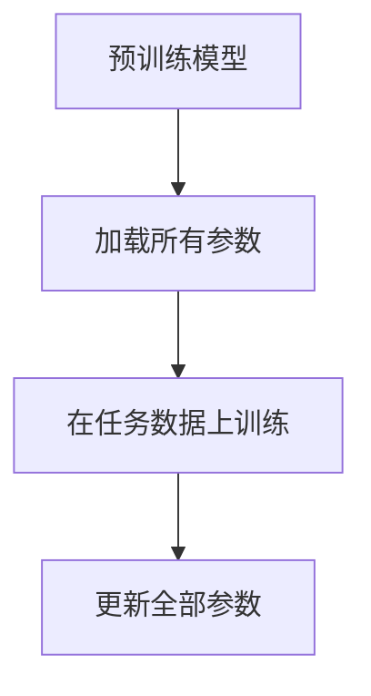
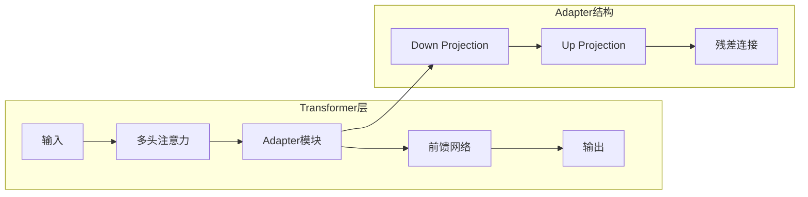
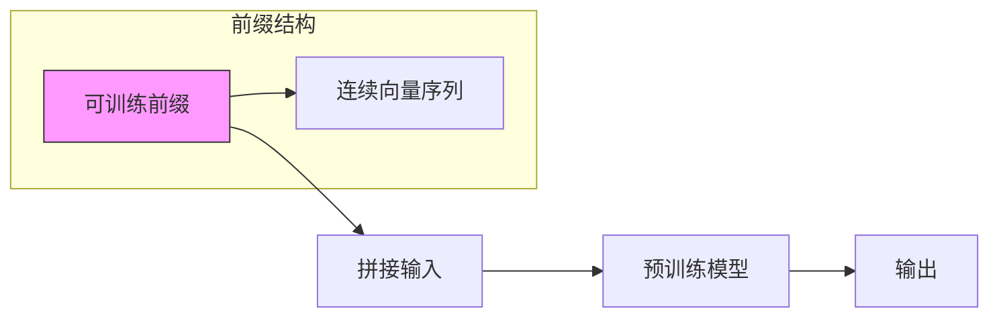
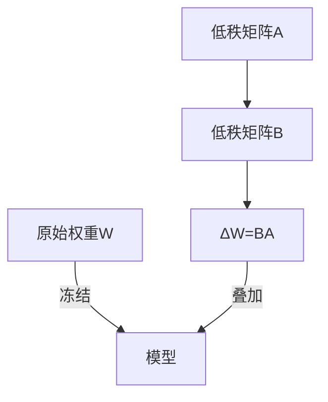

# 微调技术
## 定义
微调是指在预训练大型语言模型(Pretrained Language Model, PLM)基础上，使用特定领域或任务的数据进行进一步训练，使模型适应特定需求的技术。  

## 作用
- 领域适应：预训练模型具有通用知识，但特定领域知识不足  
- 任务适应：预训练目标(如语言建模)与下游任务目标(如分类)不一致  
- 性能提升：针对特定任务优化可以显著提高模型表现  

## 分类
1. 学习范式
- 监督学习 (SFT)：使用标注的输入-输出对进行训练
- 非监督/强化学习：依赖奖励信号、自监督目标或人类偏好

2. 参数更新范围
- 全参数微调(Full Fine-tuning)：所有层参数参与梯度更新
- 参数高效微调方法(Parameter-Efficient Fine-tuning, PEFT)：仅更新适配器/前缀/低秩矩阵等少量参数

## 方法介绍

1. FT
- 原理：更新模型所有参数，是最直接的微调方式。
- 优点：理论上能达到最佳性能,实现简单直接.
- 缺点：计算资源消耗大、容易过拟合(尤其小数据集时)、需要存储每个任务的完整模型副本。

1. 适配器微调(Adapter)
- 原理：在Transformer层间插入小型全连接网络(适配器)，只训练这些新增参数。

- 优点：参数效率高(仅新增2-4%参数)、模块化设计，易于切换任务。
- 缺点：增加推理延迟(额外计算)、需要谨慎选择插入位置。

3.  前缀微调(Prefix Tuning)  
- 我的理解：在原始输入序列前拼接一组可学习的连续向量（Prefix），这些向量仅参与注意力机制中的Key和Value计算，从而间接引导模型的生成行为，同时保持预训练模型的所有参数冻结。
- 
- 原理：通过学习可训练的**前缀向量（Prefix）**来引导模型生成特定任务的输出，而无需修改或微调整个模型的参数  
Prefix插入位置：在模型的每一层（或多层）的Key和Value矩阵前拼接Prefix对应的Key和Value向量。  
参数隔离：仅训练Prefix向量，冻结原始模型的所有参数。预训练模型的权重（如FFN、注意力投影矩阵等）完全冻结，仅Prefix向量参与梯度更新。
注意力计算时，Prefix会影响后续所有位置的隐状态。  
通过调整Prefix向量，最大化模型在特定任务上的生成概率（如文本分类、摘要生成等）。  

- 变体：  
    Prompt Tuning：仅输入层添加可学习token
    P-Tuning：使用LSTM/MLP生成更复杂的连续prompt

- 优点：完全不修改原始模型、前缀可解释性强   
- 缺点：长序列任务会占用上下文窗口、需要大量调参  

1. LoRA (Low-Rank Adaptation)
- 原理：
用低秩分解表示权重更新：ΔW = BA (A∈R^{r×k}, B∈R^{d×r}, r≪min(d,k))
W' = W + ΔW = W + BA  

- 优点：不增加推理延迟、参数效率极高(通常r=8或16)、多个任务适配器可动态加载
- 缺点：需要选择应用的目标层、秩的选择影响性能
- 实现细节：通常应用于注意力层的Q/V矩阵，初始化：A用随机高斯，B用零矩阵

5. 基于强化学习的微调(RL Fine-tuning)
- 原理：使用强化学习(如PPO)优化不可微分的指标(如BLEU, ROUGE)。
- 关键组件：奖励模型：将响应映射到标量分数；策略优化算法

